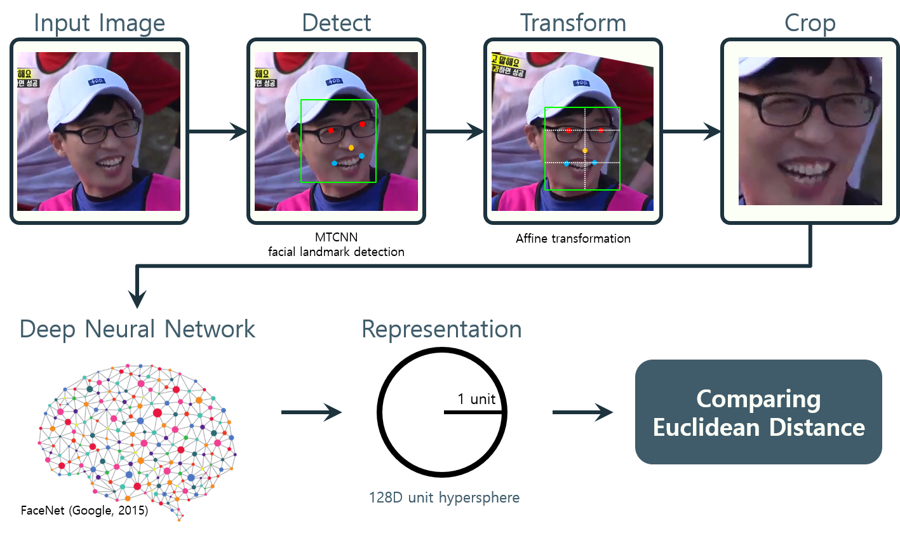

Selective Facial Mosaicing
===

*작성일 : 2019년 7월 15일*

<p align="center">
    
    
    <br>
    <sup>선택적 얼굴 모자이크 데모. 유재석 얼굴 제외하고 모두 블러링 (왼쪽), 알고리즘 디버깅과 시각화. 얼굴 bounding box와 유클리드 거리 표시 (오른쪽)</sup>
</p>



## Related Work
- FaceNet (Schroff et al., [paper](https://arxiv.org/abs/1503.03832))
- [keras-facenet](https://github.com/nyoki-mtl/keras-facenet)
- MTCNN (Zhang et al., [paper](https://arxiv.org/abs/1604.02878), [implementation](https://github.com/ipazc/mtcnn))

## Example

**1. Generate facial embedding database**
```shell
python generate_face_database.py database.json --glob mcu/*.jpg
```

**2. Play mosaiced video**
```shell
python main.py database.json mcu --video-path mcu/mcu_footage.mp4
```
